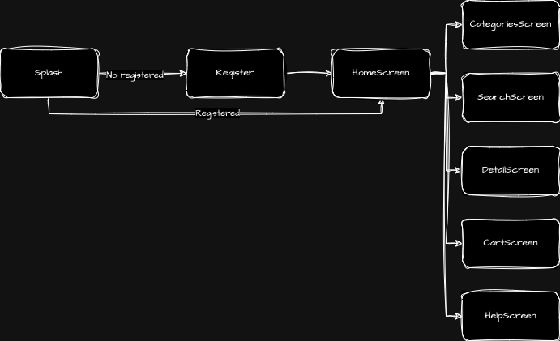

# storeapp

Proyecto de una aplicación tipo store de flutter.

## Diagrama y flujo descriptivo

El App Está compuesto principalemente de 5 pantallas así:

- HomeScreen
- SearchScren
- CategoriesScreen
- DetailScreen
- CartScreen

### HomeScreen

Cuando inicia el app entra al HomeScren, la cual muestra un Splash cuando el app Inicia, y ahí se mira si se tiene un usuario registrado, si el usuario no está registrado se le pregunta al usuario los datos de registro, y ya cuando los datos están completos se muestra el lobby del HomeScreen.

Desde el HomeScreen se puede navegar a las otras pantallas así:

Desde la barra de Servicios: (La barra de servicios se podrá expandir con mas items)

- CategoryScreen
- SearchScreen

Al cartScreen, directamente haciendo tap en el ícono del carrito.

Al detailScreen haciendo tap en cualquier promoción de un producto, las cuales están divididas en 2 areas principales así:

- Promociones normales
- Promociones grandes

### CategoryScreen

La Pantalla de categorías tiene 2 areas principales, el área de las categorías y el área del listado de productos.

En las categorías se podrá escoger o todas con "All" o la categoría requerida.

El listado de productos va a mostrar todos los productos pertenecientes a la  categoría actual. Siempre va a inciar con la categoría "All". Desde el listado de productos se puede seleccionar el detalle del producto haciendo Tap sobre éste.

Desde esta pantalla también se puede entrar al carrito.

### DetailScreen

Esta es la pantalla encargada de mostrar el detalle del producto y pueda agregar productos al carrito.

Desde esta pantalla también se puede entrar al carrito.

### SearchScreen

Esta pantalla tiene un área donde se escribe algún término o palabra que se quiera buscar de los productos, y va a mostrar un listado de los productos asociados al término buscado.

### CartScreen

Desde cualquier pantalla se puede acceder al CartScreen haciendo click sobre el ícono del carrito, el cual siempre va a mostrar cuantos items están en el carrito.

En el cartScreen se ven cuantos items están agregados al carrito y se podrá modificar las cantidades de los productos agregados al carrito.

También se observa cuanto vale la suma de todos los productos.
